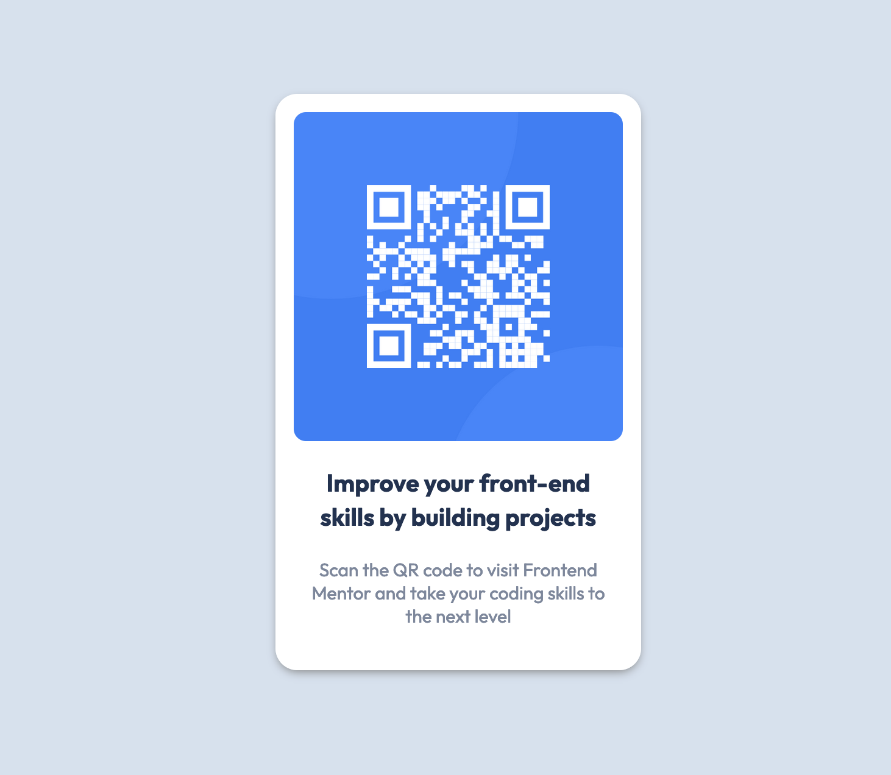

# Frontend Mentor - QR code component solution

This is a solution to the [QR code component challenge on Frontend Mentor](https://www.frontendmentor.io/challenges/qr-code-component-iux_sIO_H). Frontend Mentor challenges help you improve your coding skills by building realistic projects.

### Screenshot

### Links

- Live Site URL: [https://omeresas.github.io/FEM-QR-Code-Component/](https://omeresas.github.io/FEM-QR-Code-Component/)

### Built with

- HTML
- CSS
- Flexbox
